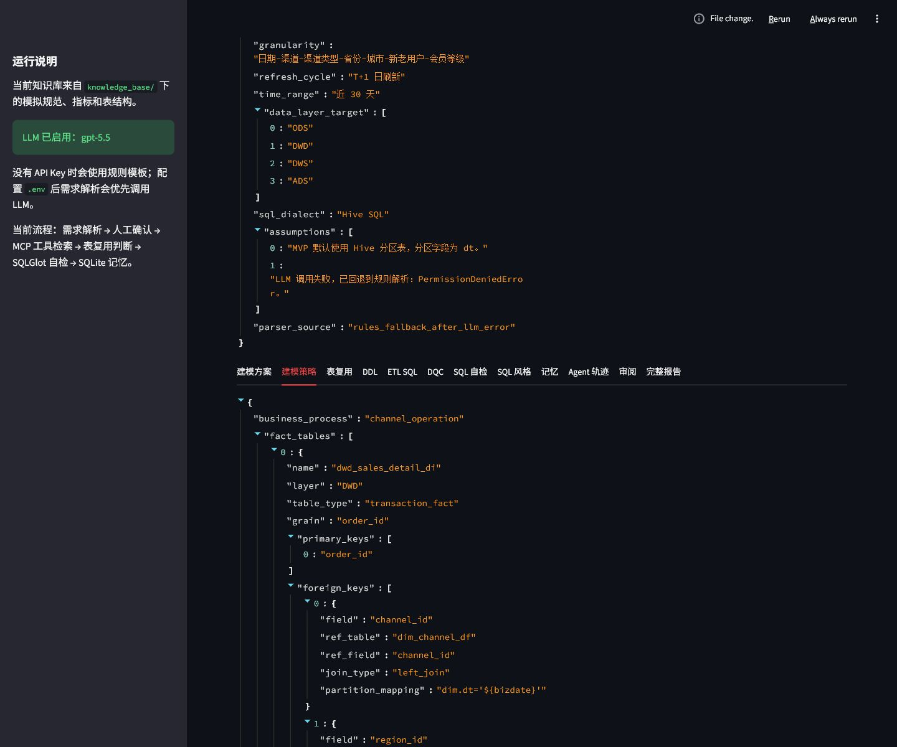
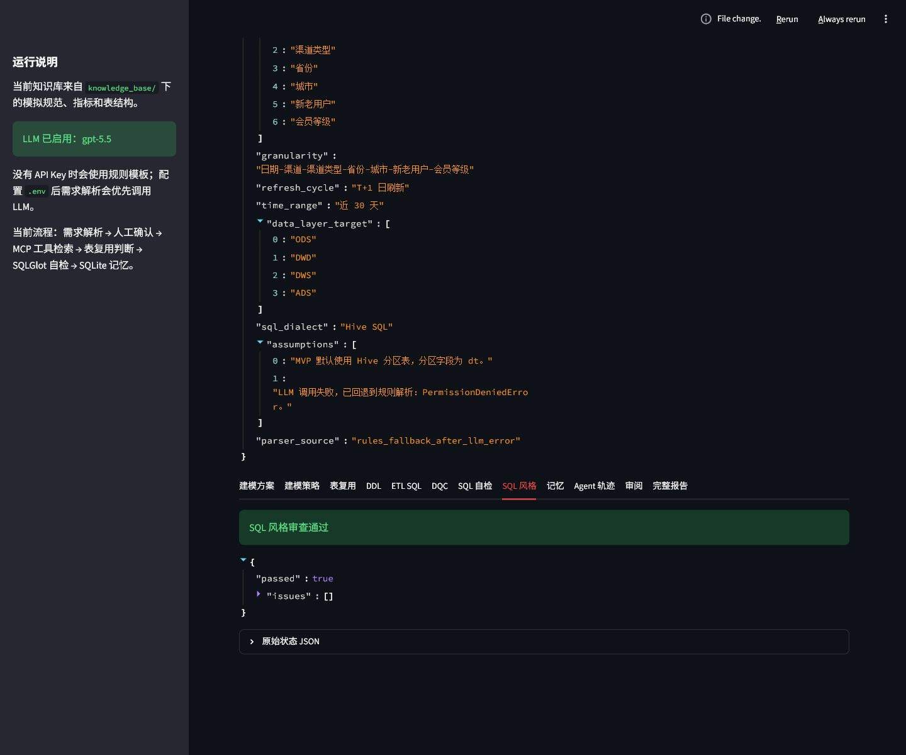
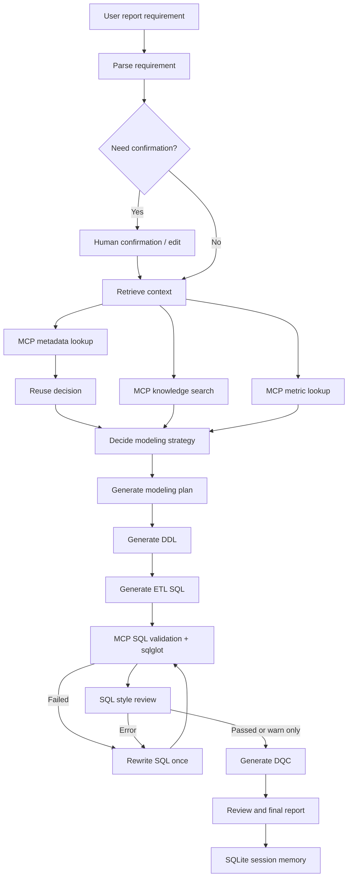

# Warehouse Agent MVP

一个面向数据开发场景的 **Report-to-Warehouse Modeling Agent**：

> 自然语言报表需求 -> 指标/维度解析 -> 人工确认 -> 元数据/RAG 工具检索 -> ODS/DWD/DWS/ADS 建模方案 -> DDL/ETL SQL/DQC -> SQL 自检。

当前项目仍是 MVP，但已经具备 Agent 雏形：LangGraph 子图状态机、MCP 工具调用、人工确认、表复用决策、建模策略决策、SQL 结构校验、SQL 风格审查、SQLite 记忆和修正回路。

## Screenshots

复杂渠道经营日报测试截图：





轻量 SVG 界面预览和真实 PNG 截图生成方式见 [docs/screenshots.md](docs/screenshots.md)。

## Features

- 解析自然语言报表需求，抽取指标、维度、粒度、刷新周期。
- 在生成前让用户确认或修改结构化需求。
- 检索本地模拟知识库，包括数仓规范、指标口径、历史表结构、DQC 模板。
- 生成 ODS、DWD、DWS、ADS 建模方案。
- 生成 Hive 风格 DDL、ETL SQL、DQC 规则。
- 记录工具调用轨迹，并对生成 SQL 做基础自检。
- 通过 MCP client 调用本地 MCP Server，提供元数据、指标口径、知识库检索和 SQL 校验工具。
- 判断已有 DWS/ADS 表是否可复用，避免盲目新建汇总表。
- 生成建模策略，明确业务过程、事实表、维度表、汇总表、应用表、join_plan 和 dependency_plan。
- 使用 `sqlglot` 做 SQL 解析和 GROUP BY 结构校验。
- 做 SQL 风格审查，覆盖 SELECT *、CTE 层数、JOIN、DIM 分区、除零保护和 INSERT 分区。
- 使用 SQLite 保存历史会话，并在相似需求中提供历史参考。
- 无 API Key 也能跑 demo；配置 API Key 后需求解析会优先调用 LLM。

## Architecture



更多设计说明见 [docs/architecture.md](docs/architecture.md)。

## Quick Start

在本目录执行：

```powershell
.\run_demo.ps1
```

启动页面：

```powershell
.\run_app.ps1
```

打开：

```text
http://127.0.0.1:8501
```

当前工作区路径包含中文，部分 `uv` 版本在 Windows 下写 `uv.lock` 可能失败，所以提供了 PowerShell 启动脚本。英文路径下也可以直接使用：

```powershell
uv run warehouse-agent --demo
uv run streamlit run app.py
```

## Example Cases

复杂案例放在 `examples/` 目录中：

- `examples/sales_channel_daily.md`：渠道经营分析日报，包含曝光/点击/下单/支付/退款/ARPU 等指标，以及渠道、地域、新老用户、会员等级等多维粒度。

这个案例会触发表复用决策：Agent 会通过 MCP 检索元数据，并优先复用公共汇总表 `dws_trade_channel_day_summary_di`，只生成面向报表消费的 ADS SQL。对应回归测试在 `tests/test_examples.py`。

## LLM Config

复制或编辑 `.env`：

```text
OPENAI_API_KEY=
OPENAI_BASE_URL=https://api.openai.com/v1
OPENAI_MODEL=gpt-5.5
WAREHOUSE_AGENT_USE_LLM=true
```

不要提交 `.env`，仓库只保留 `.env.example`。

测试 API：

```powershell
.\check_api.ps1
```

没有 API Key 时也可以运行，系统会使用规则和模板生成一个稳定演示结果。

如果 `check_api.ps1` 返回 `PermissionDeniedError: Your request was blocked.`，说明本地代码已经发起 LLM 请求，但上游接口拒绝了调用。常见原因是模型名不可用、API Key 没有该模型权限、第三方代理服务风控拦截，或接口并非完全兼容 OpenAI Chat Completions。此时 Agent 会自动回退到规则解析，`parsed.parser_source` 会显示 `rules_fallback_after_llm_error`。

## Local MCP Server

启动 stdio 模式 MCP Server：

```powershell
.\run_mcp.ps1
```

或者使用 Python：

```powershell
$env:PYTHONPATH="src;."
python -m mcp_server.server
```

LangGraph 主流程会通过 MCP client 调用这些工具。暴露的 MCP Tools：

- `search_warehouse_docs_tool`
- `get_metric_definition_tool`
- `list_tables_tool`
- `get_table_schema_tool`
- `validate_sql_tool`
- `health_check_tool`

这些工具目前读取本地模拟知识库。后续可以替换成真实 Hive、DataHub、指标平台、SQL dry-run 服务或 DQC 平台。

## Tests

运行测试：

```powershell
.\run_tests.ps1
```

运行格式化、lint、类型检查和测试：

```powershell
.\run_quality.ps1
```

运行复杂渠道经营日报案例并打印关键诊断：

```powershell
.\run_complex_case.ps1
```

当前测试覆盖：

- 需求解析不会把“支付用户数”误判成“用户”维度。
- 复杂中文术语会优先按最长词解析，避免把“支付转化率”误判成“转化率”、把“新老用户”误判成“用户”。
- 复杂渠道经营日报案例可以完整跑通，并自动复用已有 DWS 表。
- 建模策略能识别 DIM 表、增全量策略、join_plan 和 dependency_plan。
- 表复用决策会检查字段覆盖、粒度、业务过程、分区、认证和 SLA。
- SQL 风格审查能发现 SELECT *、过多 CTE 和无意义 CTE 名称。
- LangGraph 可以停在人工确认态。
- 人工确认后可以继续生成完整方案。
- SQL 自检能发现缺分区、缺 GROUP BY 等问题。
- MCP 工具可以返回指标、表结构、知识库检索和 SQL 校验结果。
- 通过 MCP stdio client 启动本地 MCP Server 并调用 `health_check_tool`。
- 主 Agent 流程会调用 MCP 工具并产出表复用决策。
- SQLite 可以保存并召回相似历史会话。
- `sqlglot` 可以发现 SELECT 非聚合字段缺少 GROUP BY 的结构问题。

## Project Structure

```text
warehouse_agent_mvp/
  app.py
  run_quality.ps1
  mcp_server/
    server.py
    tools/
      warehouse.py
  knowledge_base/
    warehouse_standards.md
    metric_definitions.md
    table_metadata.json
    dqc_templates.md
  examples/
    sales_channel_daily.md
  src/dw_agent/
    graph.py
    state.py
    mcp_client.py
    memory.py
    tools.py
    nodes/
  tests/
  docs/
```

## Current Limits

- 元数据是模拟 JSON，不是生产元数据平台。
- RAG 是关键词检索，不是向量库。
- SQL 自检包含规则校验和 `sqlglot` 结构校验，但还不是真实 SQL dry-run。
- SQL 风格审查是 `sqlglot` + 规则兜底，不是完整 SQL 审核系统。
- DQC 规则是模板生成，还没有接入真实 DQC 平台。
- 生成 SQL 是初稿，真实落地前仍需人工 review。

## Roadmap

- 接入真实 Hive/Glue/DataHub/元数据平台。
- 把 RAG 从关键词检索升级为向量检索。
- 增加 SQL parser / dry-run 校验。
- 增加调度 DAG 生成。
- 增加 CI，自动跑测试和 lint。
