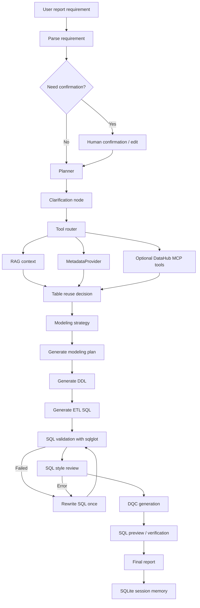

# Warehouse Agent MVP

**Warehouse Agent MVP** is a Report-to-Warehouse Agent for data development
workflows. It turns a natural-language reporting requirement into a structured
warehouse delivery package: requirement parsing, metadata retrieval, table reuse
decision, ODS/DWD/DWS/ADS modeling strategy, DDL, ETL SQL, DQC rules, SQL
validation, SQL style review, and a final review report.

This project is not a generic chat assistant. It is a controlled data warehouse
agent prototype built around a LangGraph state machine, metadata-provider tools,
RAG context retrieval, MCP tool calls, SQL structure validation, SQLite memory,
and a bounded rewrite loop.

```text
Report requirement
-> requirement parsing
-> human confirmation
-> metadata / RAG / MCP retrieval
-> table reuse decision
-> modeling strategy
-> DDL / ETL SQL / DQC generation
-> sqlglot validation
-> SQL style review
-> SQL preview / verification
-> final report
```

## Current Status

- Controlled LangGraph workflow with requirement, context, generation, and
  validation stages.
- Local JSON metadata provider for deterministic demos and tests.
- Real `information_schema` metadata provider for local DuckDB, PostgreSQL, and
  MySQL schemas.
- Optional DataHub MCP provider for asset search, schema, lineage, ownership,
  tags, glossary terms, domains, and data products.
- Local MCP server and MCP client path for warehouse tools.
- Table reuse decision node that checks field coverage, grain, business process,
  partition availability, certification, and SLA context.
- SQL generation plus `sqlglot` validation and SQL style review.
- SQLite memory for historical sessions.
- Streamlit UI for MVP interaction.
- Quality gate currently passes with `64` tests through `run_quality.ps1`.

## Screenshots

Complex channel operation daily report:


More screenshot notes are available in [docs/screenshots.md](docs/screenshots.md).

## What The Agent Produces

Given a reporting requirement, the agent can generate:

- structured metrics, dimensions, grain, refresh cycle, and assumptions,
- candidate table discovery results,
- existing DWS/ADS table reuse decision,
- DIM, fact, summary, and application table modeling strategy,
- join plan and dependency plan,
- Hive-style DDL,
- ETL SQL for DWD/DWS/ADS layers,
- DQC rules and sample checks,
- SQL validation output,
- SQL style review output,
- DataHub MCP context when enabled,
- final Markdown report for review.

## Architecture



More design details are available in [docs/architecture.md](docs/architecture.md)
and [docs/agent_upgrade.md](docs/agent_upgrade.md).

## Metadata Providers

The modeling logic reads metadata through `dw_agent.metadata.MetadataProvider`.
It does not hardcode demo table names as production logic. Table selection uses
metadata attributes such as:

- `layer`
- `table_type`
- `business_process`
- `grain`
- `primary_keys`
- `foreign_keys`
- `fields`
- `update_mode`
- `partition_key`
- `owner`
- `sla_time`
- `certified`

Supported provider modes:

```powershell
$env:WAREHOUSE_METADATA_PROVIDER="local_json"          # default mock metadata
$env:WAREHOUSE_METADATA_PROVIDER="information_schema" # DuckDB/PostgreSQL/MySQL
$env:WAREHOUSE_METADATA_PROVIDER="mcp"                # local MCP-backed provider
$env:WAREHOUSE_METADATA_PROVIDER="datahub_mcp"        # optional DataHub MCP
```

### Information Schema Mode

For a real local DuckDB demo:

```powershell
python demo/init_duckdb_demo.py
$env:WAREHOUSE_METADATA_PROVIDER="information_schema"
$env:WAREHOUSE_DB_TYPE="duckdb"
$env:WAREHOUSE_DUCKDB_PATH="./demo/warehouse_demo.duckdb"
```

See [docs/information_schema_integration.md](docs/information_schema_integration.md).

### DataHub MCP Mode

The project includes an optional `DataHubMcpProvider`. It treats DataHub as an
external data map / metadata platform and can query DataHub MCP for:

- asset search,
- dataset schema,
- upstream lineage,
- ownership,
- tags and glossary terms,
- domain and data product context.

It is disabled by default. Local JSON and `information_schema` modes do not need
DataHub.

```powershell
$env:WAREHOUSE_METADATA_PROVIDER="datahub_mcp"
$env:DATAHUB_MCP_ENABLED="true"
$env:DATAHUB_GMS_URL="http://localhost:8080"
$env:DATAHUB_GMS_TOKEN="<your-datahub-token>"
$env:DATAHUB_MCP_COMMAND="uvx"
$env:DATAHUB_MCP_PACKAGE="mcp-server-datahub@latest"
$env:DATAHUB_TIMEOUT="10"
```

Agent-facing tools:

- `search_datahub_assets`
- `get_datahub_dataset_schema`
- `get_datahub_lineage`
- `get_datahub_ownership`
- `get_datahub_tags_and_terms`

The wrapper maps those internal tool names to common DataHub MCP tools such as
`search`, `get_entities`, `get_lineage`, and `list_schema_fields`. Tokens are
read from environment variables only and are redacted from structured errors.

See [docs/datahub_mcp_integration.md](docs/datahub_mcp_integration.md) and
[config/datahub_mcp.example.yml](config/datahub_mcp.example.yml).

## Quick Start

Run the demo:

```powershell
.\run_demo.ps1
```

Start the Streamlit app:

```powershell
.\run_app.ps1
```

Open:

```text
http://127.0.0.1:8501
```

You can also run directly in an English-only path:

```powershell
uv run warehouse-agent --demo
uv run streamlit run app.py
```

## LLM Config

Copy or edit `.env`:

```text
OPENAI_API_KEY=
OPENAI_BASE_URL=https://api.openai.com/v1
OPENAI_MODEL=gpt-5.5
WAREHOUSE_AGENT_USE_LLM=true
WAREHOUSE_METADATA_PROVIDER=local_json
```

Do not commit `.env`. Use `.env.example` as the public template.

Without an API key, the agent still runs by using deterministic rule parsing.
With an API key, requirement parsing prefers the configured LLM and falls back to
rules if the upstream API rejects the request.

Test the API config:

```powershell
.\check_api.ps1
```

## Local MCP Server

Start the local stdio MCP server:

```powershell
.\run_mcp.ps1
```

Or run it with Python:

```powershell
$env:PYTHONPATH="src;."
python -m mcp_server.server
```

Exposed local MCP tools:

- `search_warehouse_docs_tool`
- `get_metric_definition_tool`
- `list_tables_tool`
- `search_tables_tool`
- `get_table_schema_tool`
- `validate_sql_tool`
- `health_check_tool`

These local tools read the demo knowledge base today. They can later be replaced
or complemented by Hive Metastore, DataHub, OpenMetadata, a metric platform, SQL
dry-run service, or DQC platform.

## Example Case

The complex case is stored in [examples/sales_channel_daily.md](examples/sales_channel_daily.md).
It asks for a channel operation daily report with traffic, order, payment,
refund, conversion, and ARPU-like metrics across channel, region, new/existing
user, and member-level dimensions.

Run:

```powershell
.\run_complex_case.ps1
```

This case exercises LLM parsing when configured, metadata retrieval, table reuse,
modeling strategy, SQL validation, and SQL style review.

## Tests

Run tests:

```powershell
.\run_tests.ps1
```

Run formatting, lint, mypy, package install, and tests:

```powershell
.\run_quality.ps1
```

Current coverage includes:

- requirement parsing edge cases,
- graph routing with human confirmation,
- local MCP server tools,
- metadata-provider-driven modeling,
- `information_schema` provider,
- DataHub MCP provider and tool wrappers with mocks,
- tool router DataHub integration,
- table reuse decision,
- modeling strategy generation,
- SQL validation,
- SQL style review,
- SQLite memory,
- full complex report flow.

## Project Structure

```text
warehouse_agent_mvp/
  app.py
  run_quality.ps1
  run_complex_case.ps1
  config/
    datahub_mcp.example.yml
  docs/
    architecture.md
    agent_upgrade.md
    datahub_mcp_integration.md
    information_schema_integration.md
  examples/
    sales_channel_daily.md
  knowledge_base/
    warehouse_standards.md
    metric_definitions.md
    table_metadata.json
    dqc_templates.md
  mcp_server/
    server.py
    tools/
      warehouse.py
  src/dw_agent/
    graph.py
    state.py
    mcp_client.py
    memory.py
    metadata/
      provider.py
      information_schema_provider.py
      datahub_mcp_provider.py
    nodes/
    tools/
      __init__.py
      datahub_mcp_client.py
      datahub_mcp_tool.py
  tests/
```

## Current Limits

- This is still an MVP, not a production autonomous agent.
- It does not deploy scheduler jobs or execute production write SQL.
- Generated SQL still needs human review before production use.
- Metric semantics still need a real metric platform or data owner approval.
- DataHub MCP integration is read-only metadata context.
- DQC rules are generated templates, not a connected production DQC platform.
- SQL preview is local and SELECT-only.
- RAG is keyword-based today, not a vector database.

## Roadmap

- Add production metadata adapters for Hive Metastore, Glue, DataHub, or
  OpenMetadata.
- Connect a real metric platform with versioned metric semantics.
- Add production SQL dry-run and permission checks.
- Generate scheduler DAGs.
- Add CI for automated tests, lint, and type checks.
- Upgrade RAG from keyword search to vector retrieval.
- Add richer DataHub/OpenMetadata lineage-driven table reuse decisions.
