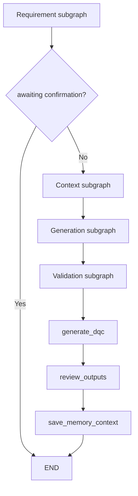
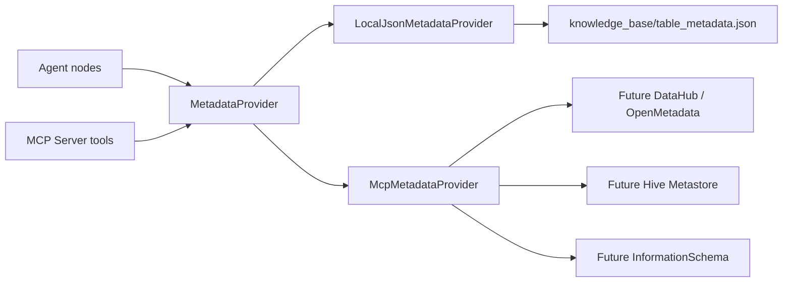

# Architecture

这个项目的目标不是替代数据开发，而是把“报表需求理解、规范检索、建模初稿生成、SQL/DQC 初稿生成和自检”串成一个可演示的 Agent MVP。

## Agent State

核心状态定义在 `src/dw_agent/state.py`，主要字段包括：

- `requirement`: 用户原始报表需求。
- `parsed`: 结构化需求，包括指标、维度、粒度、刷新周期。
- `agent_decision`: 路由判断，例如等待人工确认或继续生成。
- `retrievals`: RAG 命中文档。
- `metric_context`: 指标口径工具返回结果。
- `metadata_candidates`: 元数据候选表。
- `reuse_decision`: 是否复用已有 DWS/ADS 表的决策。
- `memory_context`: 从 SQLite 中召回的相似历史会话。
- `ddl` / `etl_sql` / `dqc_rules`: 生成结果。
- `sql_validation`: SQL 自检结果。
- `tool_trace`: 工具调用轨迹。
- `session_id`: 当前结果保存到 SQLite 后的会话 ID。

## LangGraph Flow



## Subgraphs

```text
Requirement subgraph:
  parse_requirement -> load_memory_context -> route_requirement

Context subgraph:
  retrieve_context -> decide_table_reuse

Generation subgraph:
  decide_modeling_strategy -> generate_modeling -> generate_ddl -> generate_etl

Validation subgraph:
  validate_sql -> review_sql_style -> END
  validate_sql -> rewrite_sql -> validate_sql
  review_sql_style -> rewrite_sql -> validate_sql
```

## Metadata Provider Layer

Warehouse metadata is accessed through `dw_agent.metadata.MetadataProvider`.
The current MVP default is `LocalJsonMetadataProvider`, which reads
`knowledge_base/table_metadata.json` as mock metadata. This JSON file simulates
the response shape of a real metadata platform; it is not meant to be business
logic.

Production can swap the provider to `McpMetadataProvider` or a custom provider
backed by Hive Metastore, DataHub, Glue, an internal metadata service, or a
metric platform. Modeling nodes consume the same interface:

```text
list_tables()
get_table(table_name)
search_tables(layer, table_type, business_process, fields, metrics, grain)
search_dimensions(semantic_dimensions)
search_facts(metrics, business_process)
search_summaries(dimensions, metrics, grain, business_process)
```

The selection rules use metadata attributes such as `layer`, `table_type`,
`business_process`, `grain`, `primary_keys`, `foreign_keys`, `fields`,
`update_mode`, `partition_key`, `certified`, and `sla_time`. Fixture names such
as `dim_channel_df`, `dim_region_df`, and `dwd_sales_detail_di` may appear in
demo metadata, but they are not hardcoded modeling rules.



The MCP server calls the same provider boundary for `list_tables_tool`,
`search_tables_tool`, and `get_table_schema_tool`. Replacing local JSON with a
real metadata source should therefore happen inside the provider layer instead
of inside agent nodes or MCP tool handlers.

## Tool Layer

底层工具定义在 `src/dw_agent/tools.py`：

- `knowledge_search_tool`
- `metric_lookup_tool`
- `metadata_lookup_tool`
- `sql_validation_tool`

MCP Server 定义在 `mcp_server/server.py`，复用 `mcp_server/tools/warehouse.py` 中的工具包装。LangGraph 主流程通过 `src/dw_agent/mcp_client.py` 以 stdio transport 调用 MCP tools。

## MCP Design

当前 MCP Server 暴露本地模拟工具：

```text
search_warehouse_docs_tool(query, top_k)
get_metric_definition_tool(metric_name)
list_tables_tool(layer)
get_table_schema_tool(table_name)
validate_sql_tool(ddl, etl_sql, parsed_requirement)
health_check_tool()
```

后续生产化时可以把这些工具背后的实现替换为真实服务：

- 元数据平台：DataHub / Atlas / Glue / Hive Metastore。
- 指标平台：指标口径、负责人、血缘、认证状态。
- SQL 服务：SQL parser、SQL dry-run、字段存在性校验。
- DQC 平台：规则注册、阈值配置、监控结果查询。

## SQL Validation

SQL 自检包含两层：

- 规则检查：分区、INSERT 数量、指标字段、维度字段、粒度字段。
- `sqlglot` 结构检查：DDL/ETL 解析、DWS GROUP BY 字段和 SELECT 非聚合字段对齐。

当表复用决策为 `reuse_existing_dws` 时，校验器允许 ETL 只生成 DWD 和 ADS 两段 INSERT，并跳过 DWS GROUP BY 必检。

## Memory

SQLite 记忆定义在 `src/dw_agent/memory.py`，默认写入：

```text
data/sessions.db
```

保存内容包括原始需求、结构化解析结果、表复用决策、SQL 自检结果和最终报告。下一次解析相似需求时，会按业务主题、指标和维度重叠度召回最近历史会话。

## Why This Counts As An Agent MVP

它不是简单 Prompt 模板，因为它具备：

- 明确状态对象。
- 条件路由。
- 人工确认断点。
- 工具调用轨迹。
- 自检与重写回路。
- 可替换的 MCP 工具边界。
- SQLite 会话记忆。
- 表复用决策。

它仍然不是生产级 Agent，因为工具还使用模拟数据，SQL 也没有真实执行。
