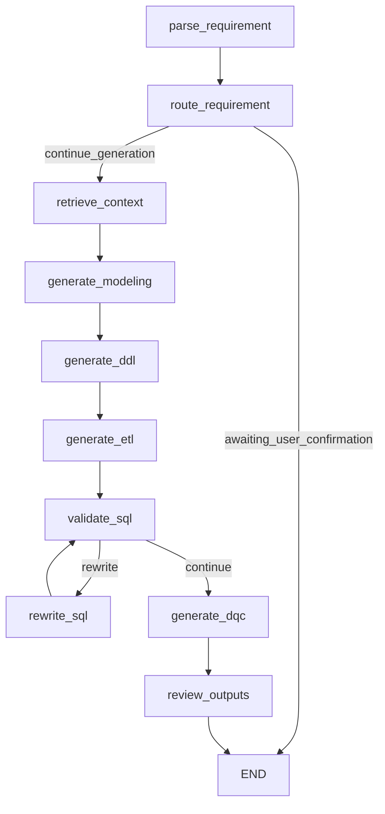

# Architecture

这个项目的目标不是替代数据开发，而是把“报表需求理解、规范检索、建模初稿生成、SQL/DQC 初稿生成和自检”串成一个可演示的 Agent MVP。

## Agent State

核心状态定义在 `src/dw_agent/state.py`，主要字段包括：

- `requirement`: 用户原始报表需求。
- `parsed`: 结构化需求，包括指标、维度、粒度、刷新周期。
- `agent_decision`: 路由判断，例如等待人工确认或继续生成。
- `retrievals`: RAG 命中文档。
- `metric_context`: 指标口径工具返回结果。
- `metadata_candidates`: 元数据候选表。
- `ddl` / `etl_sql` / `dqc_rules`: 生成结果。
- `sql_validation`: SQL 自检结果。
- `tool_trace`: 工具调用轨迹。

## LangGraph Flow



## Tool Layer

本地工具定义在 `src/dw_agent/tools.py`：

- `knowledge_search_tool`
- `metric_lookup_tool`
- `metadata_lookup_tool`
- `sql_validation_tool`

MCP Server 定义在 `mcp_server/server.py`，复用 `mcp_server/tools/warehouse.py` 中的工具包装。

## MCP Design

当前 MCP Server 暴露本地模拟工具：

```text
search_warehouse_docs_tool(query, top_k)
get_metric_definition_tool(metric_name)
list_tables_tool(layer)
get_table_schema_tool(table_name)
validate_sql_tool(ddl, etl_sql, parsed_requirement)
health_check_tool()
```

后续生产化时可以把这些工具背后的实现替换为真实服务：

- 元数据平台：DataHub / Atlas / Glue / Hive Metastore。
- 指标平台：指标口径、负责人、血缘、认证状态。
- SQL 服务：SQL parser、SQL dry-run、字段存在性校验。
- DQC 平台：规则注册、阈值配置、监控结果查询。

## Why This Counts As An Agent MVP

它不是简单 Prompt 模板，因为它具备：

- 明确状态对象。
- 条件路由。
- 人工确认断点。
- 工具调用轨迹。
- 自检与重写回路。
- 可替换的 MCP 工具边界。

它仍然不是生产级 Agent，因为工具还使用模拟数据，SQL 也没有真实执行。
