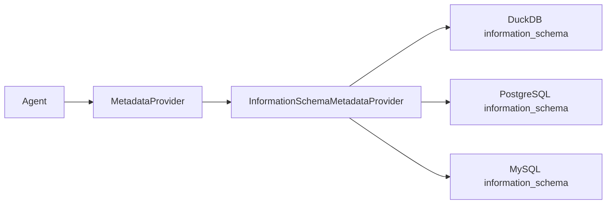

# Information Schema Integration

`InformationSchemaMetadataProvider` lets the agent read real local database
schemas instead of relying only on `knowledge_base/table_metadata.json`.

## Why Information Schema

`information_schema` is the lightest realistic metadata source for a local MVP:

- It is more realistic than JSON fixtures because tables and columns actually
  exist in a database.
- It does not require DataHub, OpenMetadata, Hive Metastore, or a company
  metadata platform.
- It gives the agent a real list of tables, columns, types, nullable flags, and
  primary-key hints where available.

## Architecture



Agent nodes still depend only on the `MetadataProvider` interface. Database
connection details stay inside `InformationSchemaMetadataProvider`.

## DuckDB Demo

Create the local demo database:

```powershell
python demo/init_duckdb_demo.py
```

This creates `demo/warehouse_demo.duckdb` with real warehouse-like tables such
as `dim_channel_df`, `dim_category_df`, `dwd_sales_detail_di`,
`dwd_user_behavior_event_di`, `dws_category_channel_day_summary_di`, and
`ads_category_operation_daily_report_di`.

Run the agent with the information schema provider:

```powershell
$env:WAREHOUSE_METADATA_PROVIDER="information_schema"
$env:WAREHOUSE_DB_TYPE="duckdb"
$env:WAREHOUSE_DUCKDB_PATH="./demo/warehouse_demo.duckdb"
```

## PostgreSQL And MySQL

PostgreSQL:

```powershell
$env:WAREHOUSE_METADATA_PROVIDER="information_schema"
$env:WAREHOUSE_DB_TYPE="postgres"
$env:WAREHOUSE_DB_HOST="localhost"
$env:WAREHOUSE_DB_PORT="5432"
$env:WAREHOUSE_DB_NAME="warehouse_demo"
$env:WAREHOUSE_DB_USER="postgres"
$env:WAREHOUSE_DB_PASSWORD="postgres"
$env:WAREHOUSE_DB_SCHEMA="public"
```

MySQL:

```powershell
$env:WAREHOUSE_METADATA_PROVIDER="information_schema"
$env:WAREHOUSE_DB_TYPE="mysql"
$env:WAREHOUSE_DB_HOST="localhost"
$env:WAREHOUSE_DB_PORT="3306"
$env:WAREHOUSE_DB_NAME="warehouse_demo"
$env:WAREHOUSE_DB_USER="root"
$env:WAREHOUSE_DB_PASSWORD="root"
```

Do not commit real passwords. PostgreSQL and MySQL dependencies are optional;
the provider raises a clear error if the required driver is missing.

## Semantic Inference

`semantic_mapper.py` enriches technical metadata into warehouse metadata:

- table prefix infers `layer`: `ods_`, `dwd_`, `dim_`, `dws_`, `ads_`
- table suffix infers `update_mode`: `_di`, `_df`, `_mi`
- fields and names infer `table_type`, `business_process`, `partition_key`,
  `primary_keys`, and `grain`
- DWD foreign-key hints are inferred for common dimension keys such as
  `channel_id`, `region_id`, `user_id`, and `category_id`

## Current Limits

- `information_schema` mostly provides technical metadata.
- `grain`, `business_process`, and `update_mode` are inferred by rules and still
  need review before production.
- Metric definitions, SLA, owners, certification status, and lineage still need
  a metric platform or metadata platform.
- SQL validation is not a real dry-run yet.

## Future Sources

The same provider boundary can later be backed by:

- dbt manifest/catalog
- DataHub or OpenMetadata
- Hive Metastore, Trino, or Iceberg Catalog
- a production SQL dry-run service
